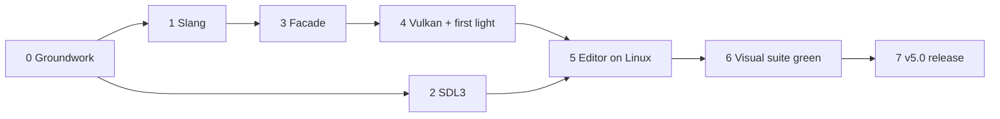

# TiXL v5: Linux + Windows on Vulkan

**Status:** In progress — updated 2026-09-19. See [Progress](#progress-2026-09-19).
**Scope:** Linux and Windows first. macOS and the Microsoft Store follow in v5.x.
**Release label:** TiXL v5. v5.0 does not need feature parity with v4.

## Goals

1. Develop TiXL on Arch Linux with Rider: editor, Player, operator hot reload, visual test suite.
2. One graphics backend everywhere: Vulkan. D3D11 survives only as a temporary scaffold and is deleted
   before v5.0.
3. Keep the HLSL shaders; Slang compiles them.
4. Keep the operator model and existing projects. `.t3` files load unchanged; user C# operators migrate
   automatically.
5. Build, sign and release Windows from GitHub CI.

## Non-goals for v5.0

- Feature parity. Legacy, experimental and hard-to-port ops and packages may be missing (see
  [Scope for v5.0](#scope-for-v50)).
- macOS and the Microsoft Store.
- NDI, Spout, Mediapipe, webcams, screen capture, SpaceMouse, Ableton Link, OpenCV-based ops.
- Upgrading ImGui (Hexa.NET.ImGui / ImGui 1.92), ImGui multi-viewport, HDR output.
- Beating D3D11's CPU overhead on Windows. The bar is: no visible slowdown and no hitches.

## Key decisions

1. **Vulkan everywhere, Windows included.** One backend, one shader format (SPIR-V), one set of bugs.
   D3D11 is frozen at Shader Model 5.0, and SharpDX has been unmaintained since 2019.
2. **Two layers: a Vulkan-shaped backend API, and a D3D11-shaped compatibility facade on top**
   *(revised 2026-09-20; it was one D3D11-shaped layer)*. The 44 `_dx11` ops hand the D3D11 state machine
   to users as the operator model, and saved projects are full of them, so a D3D11-shaped layer has to exist
   — but it is a translator, not the foundation. The backend API (resources, pipelines, command encoders,
   explicit barriers, descriptor tables) is the only thing backends implement and what new and hot code
   targets directly; the facade mirrors the ~60 SharpDX calls and types so today's ops migrate by swapping
   `using` lines. The Vulkan backend turns state into cached pipelines, tracks barriers and delays resource
   destruction. This keeps the D3D11 shape removable: the render core moves to the backend API subsystem by
   subsystem after v5.0, and legacy ops keep the facade for as long as projects use them. See
   [Plan_GraphicsFacade](Plan_GraphicsFacade.md).
3. **Slang** compiles the existing HLSL: DXBC for the temporary D3D11 path, SPIR-V for Vulkan.
4. **SDL3** (ppy's SDL3-CS bindings) replaces WinForms, SharpDX.Desktop and Silk/GLFW for windows,
   input, displays, clipboard, dialogs, drag & drop and gamepads.
5. **Vortice.Vulkan + VMA** for Vulkan bindings and memory allocation (alternative: Silk.NET.Vulkan).
6. **Foundation work before the Vulkan switch lands on `main` and ships in v4.x** without intended
   behavior changes. v4 users then test SDL3 and Slang on real Windows machines long before v5.
7. **Platform availability is data, not a crash.** Ops and packages declare their platforms.
   Unavailable ops stay in projects as editable placeholders.

## Current state (measured 2026-09-11)

| Area | Numbers | Consequence |
|---|---|---|
| D3D11 in C# | ~145 files use D3D11 namespaces (59 Lib, 27 Editor, 24 Core); ~100 touch the device context; ~60 distinct calls; ~70 texture formats | Small enough to mirror as a facade |
| Low-level ops | 44 `_dx11` ops (api 23, buffer 10, fxsetup 11) | Their semantics define the facade |
| Ops with platform code | 91 of 956 Lib ops touch D3D11, Win32 or native libraries | The other ~865 port for free once the core works |
| Shaders | 434 HLSL; 223 compute; vertex pulling via `SV_VertexID` (74); no tessellation; registers up to b6/t11/u4/s2; 12 use append/consume buffers | Vulkan-friendly |
| Geometry shaders | 2 files, used by `SetEnvironment` / `TextureToCubeMap` (PBR environment); `SetEnvironment` is used by 44 compositions | Rewrite without a geometry shader, don't drop |
| Saved values | Enum members are stored by name (`"Wrap"`, `"MinMagMipLinear"`, `"R16G16B16A16_Float"`) | Facade enums keep identical member names and values |
| Saved type strings | 236 `.t3` files contain `"Type": "SharpDX.Direct3D11.…"`; the reader ignores it — values parse via the slot's C# type ([SymbolJson.cs](../../Core/Model/SymbolJson.cs) `ReadChildInputValue`) | The namespace change is safe; saving rewrites the strings once |
| Visual suite | ~98 tests; reaches 415/956 Lib ops (43%), 32/44 `_dx11` ops, ~39% of shaders incl. includes | Strong oracle for the render core |
| Visual-suite gaps | `DrawInstancedIndirect`, `DsvFromTexture2d`, `UavFromBuffer`, `ClearRenderTarget`, 3D textures, particles (7 of 19 ops) | Exactly what the Vulkan backend must implement — add tests first |
| Windowing | WinForms (`ImGuiDx11RenderForm`, 21 Editor files), SharpDX.Desktop (Player), Silk/GLFW+OpenGL (`SilkWindows` popups) | Three stacks → SDL3 |
| ImGui | ImGui.NET 1.91.6.1; 380 files, ~7,700 calls; SRV `NativePointer` used as texture id | Keep ImGui.NET; replace texture ids |
| WIC / System.Drawing | 10 files, incl. `FontAtlasGenerator`, `LoadGltfScene`, `VisualTest`, `ScreenshotWriter`, thumbnails | Needed even for the first slice |
| SharpDX helpers | `DataStream` 23 files, `DataBox` 25, `DataRectangle` 11, `NativePointer` 18; SharpDX.Mathematics for math in ~60 files | Facade replacements; math stays if it loads on Linux |
| Off-thread GPU work | `ThumbnailManager`, `VideoClipThumbnailCache` and video-input ops create resources on worker threads | Resource creation must stay thread-safe |
| Shader compiler | FXC via `SharpDX.D3DCompiler`, SM 5.0, custom include handler | → Slang |
| Operator compilation | `dotnet build` through the CLI | Works on Linux with the .NET SDK |
| Missing symbols | An unresolved child stops the editor from overwriting its parent's file (`Symbol.UnresolvedChildCount`) | v5 needs editable placeholders |
| Target frameworks | Core, Editor, Lib, Player: `net10.0-windows`; Core sets `UseWindowsForms` for 2 System.Drawing uses | Core → `net10.0` looks cheap |

## Progress (2026-09-19)

Work happens on `feat/linux-port`, branched from `main` after the output-setup merge. Development machine:
Arch Linux (KDE Wayland), AMD Radeon 8060S (RADV, Mesa 26.2, Vulkan 1.4).

Done:

- **Case sensitivity.** Operator package folders and csproj files match their package names (`Examples`,
  `Unsplash`, `Ndi`, `Skills`, `Spout`); the solution, installer and the Editor's release package list use the
  same casing. No two tracked paths differ only in case, and no asset address or shader `#include` has a case
  mismatch. The whole solution compiles on Linux with `-p:EnableWindowsTargeting=true`.
- **Core → `net10.0`** (Phase 0, item 7, partly). Dropping `UseWindowsForms` needed no code change. The real
  blocker was `OpenCvSharp4.Windows`, which pulls in WPF; OpenCV moved to the packages that use it. `Core.Tests`
  pass on Linux. Not done yet: WASAPI input behind an interface.
- **Vulkan spike** (`Spikes/VulkanPlayerSpike`). SDL3 window, Vulkan 1.3 device and swapchain (Vortice.Vulkan),
  and Lib's unmodified `MandelbrotFractal.hlsl` compiled by `slangc`. Descriptor layout from Slang reflection,
  push descriptors, negative viewport height for D3D's Y orientation. 120 fps on Wayland, clean under the
  validation layers (synchronization validation was requested via environment variable, not confirmed active).
- **Slang survey** (Phase 1, steps 1–2; `Spikes/ShaderSurvey/shader_survey.py`). Compiles every (file, entry
  point, stage) the operators reference, plus unreferenced files with guessed entry points. Results:
  - All 483 constant buffers match D3D packing with `-fvk-use-dx-layout`, checked against Slang's HLSL-target
    layout and an independent implementation of FXC's rules. Without that flag Slang uses std140-style packing
    and many members move.
  - Failures were dominated by two FXC leniencies: duplicate cbuffer names in one file and implicit
    truncation (`float4` into a `float3` member). Both are fixed on `main` (commit `b570f2091`, 105 files, one
    line per edit, behavior unchanged; visual suite 96/98 with the 2 known flaky tests, no FXC errors).
    Referenced entry points that compile: 170 → 261 of 276.
  - Compile time via the `slangc` command line: ~180 ms median per entry point, single-threaded.
- **Player on SDL3** (Phase 2, Player part). The Player targets `net10.0` and no longer uses WinForms,
  SharpDX.Desktop or MsForms. New `SdlPlatform/` project for the parts the Editor will reuse: `SdlCoreUi`,
  `SdlDisplayProvider`, `SdlKeyMap` (SDL keys → Win32 key codes, US and German punctuation), `SdlWindowIcon`.
  `PlayerWindow` wraps an SDL window with its DXGI swap chain and serves the main and output-setup windows.
  Rendering is still D3D11, so on Linux the Player stops after creating its window.
  - Verified on Windows (`.tests-manual/player-sdl3-window-input.md`): startup dialog, loading, rendering,
    audio, keyboard and mouse input ops, window icon, Alt+Enter, client size at 150 % display scaling,
    fullscreen / windowed / Alt+Enter on a second display, clean exit via Esc and the close button, SVG ops in
    an export.
  - The `net10.0` Player no longer ships the Windows Desktop runtime; operators that need
    `System.Drawing.Common` (SVG, GDI+ text, OpenCV bitmaps) now get it from a package reference.

Findings that change this plan (folded into the sections below): `-fvk-use-dx-layout` is mandatory; the
backend needs `scalarBlockLayout` and `shaderDrawParameters`; Slang names every SPIR-V entry point `main`;
the global `parameters` list in Slang's reflection covers the whole file, so per-entry-point usage must come
from `entryPoints[].bindings[].binding.used`.

Open items from this work:

- Player on Windows, not yet tested: German keyboard layout, key release on focus loss, output setup bound to
  two displays. The Editor numbers displays in WinForms' order, the Player in SDL's; bindings saved in the
  Editor may point at a different monitor until the Editor's display handling moves to SDL.
- 15 referenced shader entry points still fail in Slang and need a decision: struct assignment between
  `Point` and `Particle`, out-parameters given non-variables, mismatched vector sizes in operators, `SSAO`,
  `depth-to-linear`, `mesh-CollapseVertices`, `DrawPointsShaded`, and `RenderToCubemap` (replaced anyway).
  `DrawTubes` / `DrawTubesArcLength` compile but index an array with a negative constant.
- Not surveyed: ShaderGraph-generated code (6 shader ops take a connected source). Matrix memory order in
  cbuffers follows Slang's documented convention but still needs a GPU read-back test.
- `SilkWindows` (startup dialog, message boxes) still runs GLFW + OpenGL next to SDL3; its assembly probes log
  misleading "reinstall TiXL" warnings. Folding it into SDL3 is deferred.
- Agent hours per commit were not tracked.

## Architecture

### Graphics layer

Projects:

- `Graphics/` (`net10.0`, `T3.Graphics`): the Vulkan-shaped backend API and the value types both layers
  share. TiXL's existing wrapper types (`Texture2D`, `Texture3D`, `BufferWithViews`, shader types) move here
  and keep their namespaces.
- `Graphics.Compat/` (`T3.Graphics.Compat`): the D3D11-shaped facade the operators call. One consumer of the
  backend API, removable subsystem by subsystem after v5.0.
- `Graphics.D3D11/`: implements the backend API on SharpDX (pipelines become state objects, barriers are
  no-ops). Windows only. Deleted before v5.0.
- `Graphics.Vulkan/`: the real backend.

Facade API — mirrors the SharpDX subset TiXL uses:

- `Device` (resource creation, thread-safe) and `DeviceContext` (immediate, main thread only) with the
  stage objects `VertexShader`, `PixelShader`, `ComputeShader`, `InputAssembler`, `Rasterizer`,
  `OutputMerger`.
- Context calls: `Draw`, `DrawIndexed`, `DrawInstancedIndirect`, `Dispatch`, `DispatchIndirect`,
  `Clear*View`, `CopyResource`, `CopySubresourceRegion`, `CopyStructureCount`, `UpdateSubresource`,
  `MapSubresource` / `UnmapSubresource`, `GenerateMips`, `ResolveSubresource`, `Flush`, `ClearState`,
  query `Begin` / `End` / `GetData`.
- Resources, views, states, shaders, `InputLayout`, `Query`, and SharpDX-shaped description structs.
- Enums copied from SharpDX's MIT-licensed source with identical member names and values.
- Replacements for `DataStream`, `DataBox` and `DataRectangle`.
- `ShaderResourceView.ImGuiTextureId` instead of `NativePointer` — a handle the ImGui renderer resolves.
- `DebugName` maps to Vulkan debug names, so resources show up by name in RenderDoc.
- A TiXL-specific swapchain API created from an SDL window: a DXGI swapchain from the HWND on D3D11, a
  `VkSurfaceKHR` on Vulkan.

Compatibility contract — behavior ops rely on today, often without knowing it:

- Binding a disposed or null view unbinds the slot (SharpDX turns disposed objects into null pointers).
  Never crash.
- Out-of-bounds buffer reads return 0 and out-of-bounds writes are dropped (`robustness2` on Vulkan).
- Null descriptors are valid (`robustness2.nullDescriptor`).
- Writes by one draw or dispatch are visible to the next (automatic barriers).
- `Map(Read)` blocks until the GPU is done — slow but correct. Per-frame readback ops get an async API.
- `Map(WriteDiscard)` and `UpdateSubresource` on constant buffers never stall and never break a render
  pass: each update goes to a fresh slice of a per-frame upload ring ("renaming").
- Resources can be created from any thread; the immediate context is main-thread only.
- `Dispose()` releases the resource after the GPU has finished the frames that used it.

### Vulkan backend

- **Baseline:** Vulkan 1.3 (dynamic rendering, synchronization2, timeline semaphores, maintenance4) plus
  `VK_KHR_push_descriptor` and `robustness2`. Used when present: extended dynamic state 3 (EDS3),
  graphics pipeline libraries, custom border colors, memory budget, debug utils. Required features
  include anisotropic filtering, independent blend, wireframe fill, depth clamp, BC texture
  compression, storage-image reads and writes without a format, `scalarBlockLayout` (structured buffers
  keep D3D's tight packing, e.g. a 12-byte `float3` stride) and `shaderDrawParameters` (Slang implements
  `SV_VertexID` as `gl_VertexIndex - gl_BaseVertex` to keep D3D's draw-relative ids).
- **Frames in flight:** 2–3, paced by a timeline semaphore. Per frame: a command buffer, an upload ring,
  a fallback descriptor pool, a deferred-destruction list.
- **State → pipeline:** a hash of shaders, blend, raster, depth-stencil, input layout, topology class,
  target formats and sample count. Dynamic state for viewport, scissor, cull mode, front face,
  depth/stencil and topology; blend too where EDS3 exists. Pipeline libraries link pipelines quickly
  where available. The `VkPipelineCache` persists on disk.
- **Pre-warm:** record the pipeline keys each project uses (in its `.meta/` folder) and build them in the
  background when the project loads.
- **Descriptors:** reflection gives each shader's bindings. D3D register classes map to fixed binding
  ranges in one descriptor set via Slang's register shifts (e.g. `s` 0–15, `b` 16–31, `t` 32–159,
  `u` 160–167). Push descriptors per draw and dispatch; only bindings the shader uses are written.
- **Render passes:** begin lazily at the first draw after a target change; end on copies, dispatches,
  readbacks and target changes. A clear directly before the first draw becomes `loadOp = CLEAR`.
- **Barriers:** per-subresource tracking of the last access (read/write, stage, layout), batched before
  each command. Start conservative; optimize with measurements.
- **Memory:** D3D11 never made TiXL think about this — the OS pages allocations in and out of VRAM, so
  overcommitting only got slower and running out was practically impossible. Vulkan allocates from explicit
  heaps, `vkAllocateMemory` can fail, and the number of allocations is capped (often ~4096), so the backend
  has to provide that comfort itself:
  - VMA sub-allocation, so thousands of small resources share few allocations, plus a pool for transient
    render targets, which operators create and drop constantly.
  - A fallback chain when an allocation fails: retry in a non-device-local heap (slow, like D3D11 spilling to
    system memory), and only then fail.
  - A memory-pressure hook that drops rebuildable caches first — thumbnail atlas, proxy textures, pooled
    targets — and retries.
  - Failure is never a crash: an operator gets a null output, exactly as it does for any other failed
    resource today.
  - `VK_EXT_memory_budget` feeds the metrics and an editor warning as usage approaches the budget.
  - Residency management does not disappear (WDDM on Windows, amdgpu on Linux still evict), but how
    gracefully each driver overcommits differs and has to be measured — see Phase 6.
- **D3D11 specifics:**
  - Append/consume counters live in separate counter buffers (Slang emits them). Initial counts are
    fills; `CopyStructureCount` is a copy.
  - Mips come from a blit chain, with a compute fallback for formats without linear blits.
  - A DXGI → Vulkan format table. D24S8 falls back to D32S8 where it's unsupported (AMD). Typeless
    formats become mutable-format images.
  - A negative viewport height flips Y; front-face winding is flipped to match.
  - Timestamps via `vkCmdWriteTimestamp`, which keeps `GpuMeasure` working.
- **Presentation:** one swapchain paces the frame (FIFO); other windows use MAILBOX or IMMEDIATE. The loop
  never waits on a hidden window — Wayland sends no frame callbacks to hidden windows.

### Shaders (Slang)

- In-process Slang through thin C# bindings to its COM-style API. The spike uses the `slangc` command
  line.
- The include handler becomes a Slang file system with the same shared-include resolution.
- Targets: DXBC (temporary, through FXC on Windows) and SPIR-V.
- Constant buffers keep D3D/FXC packing, because the C# structs depend on it. That requires
  `-fvk-use-dx-layout`; without it Slang uses std140-style packing. An automated check compares every
  cbuffer member offset against D3D's packing rules and must find zero differences (it does, for all 483
  cbuffers of the survey).
- Fixed compiler options: profile `sm_5_0` with `-capability spirv_1_5`; `-D sampler=SamplerState` for the
  legacy keyword ~225 shaders (and user shaders) use; register shifts `s` 0–15, `b` 16–31, `t` 32–159,
  `u` 160+ in set 0. SPIR-V entry points are always named `main`.
- Per-entry-point resource usage comes from `entryPoints[].bindings[].binding.used` in Slang's reflection; the
  global parameter list covers every resource declared in the file.
- Compiled blobs and reflection are cached on disk, keyed by source and include hashes, defines, entry
  point, target and Slang version.
- Errors map to file and line in TiXL's shader error display, including ShaderGraph-generated code.
- The Slang version is pinned. Upgrades are deliberate, because they can change generated code.

### Platform layer (SDL3)

- One SDL3 window per editor, output and Player window. During v4.x the D3D11 swapchain is created from
  SDL's HWND.
- ImGui platform backend: a C# port of `imgui_impl_sdl3` (input, cursors, clipboard, IME, gamepads).
- TiXL keeps its own `Key` enum and `KeyMap`; SDL scancodes and keycodes map to it. German QWERTZ must
  behave exactly as it does on Windows today.
- Replaced: `ImGuiDx11RenderForm`, `AppWindow`, `ProgramWindows`, `MouseWheelPanning`, the `MsForms`
  wrappers (cursor, dialogs), `SplashScreen`, direct `Screen.AllScreens` use (→ `IDisplayProvider`
  backed by SDL), XInput (→ SDL gamepads), SpaceMouse raw input (→ SDL HID, or dropped for v5.0), the
  Player's `RenderForm` and startup dialog, the `SilkWindows` popups.
- `SilkWindows` popups (startup dialog, message boxes behind `BlockingWindow`, ~40 Editor call sites)
  become an SDL3 provider in `SdlPlatform/` implementing the same `IImguiWindowProvider` /
  `IMessageBoxProvider` interfaces. They draw with SDL's 2D renderer and a port of ImGui's
  `imgui_impl_sdlrenderer3` backend, not OpenGL: these dialogs must work before any GPU device exists, and
  SDL picks D3D, Vulkan or Metal underneath. `ImguiWindows/` drops its Silk.NET types for
  `System.Numerics`.
- SDL3 file dialogs are asynchronous (desktop portals on Linux), so call sites need callbacks.
- Output windows go fullscreen on a chosen display, which works on Wayland. Absolute window positioning
  does not exist on Wayland.

### Op and package availability

- A `[SupportedPlatforms]` attribute on op classes with platform code; a package-level property for whole
  packages (Ndi, Spout, Mediapipe…).
- A v5 status for legacy and experimental ops: hidden in the library, still loadable.
- Compositions inherit unavailability from their children, computed at load.
- **Placeholders:** an unresolved or unavailable child keeps its JSON (ids, name, position, input values)
  and its connections, so the composition stays editable and saving round-trips it. This replaces
  today's protection, which blocks saving the parent via `UnresolvedChildCount`.
- Lib ops with Windows-only dependencies (OpenCV, DirectShow, swiftcam, Ableton Link, Svg /
  System.Drawing) move into a Windows-only package. They keep their GUIDs, so projects keep working.

### Serialization and migration

- Enum member names stay identical, so saved values load unchanged.
- The `Type` strings in `.t3` input values change on save. Re-save all library symbols once, in a single
  commit, to avoid piecemeal diff noise. Before changing namespaces, check whether `.var` files
  (variations, snapshots, presets) use type names.
- A project-format migration step (e.g. `Editor/Migrations/Steps/To3_PlatformNeutral.cs`) updates user
  packages: target framework `net10.0`, SharpDX package references removed, `using SharpDX.*` rewritten
  in operator code, path separators normalized.

## Scope for v5.0

In:

- Editor and Player on Linux (Wayland, with X11 fallback through SDL3) and Windows. Vulkan only.
- Lib, TypeOperators and the examples, minus the ops you flag.
- Audio playback (BASS) and audio input: WASAPI on Windows; BASS recording on Linux, with PipeWire
  monitor sources for loopback.
- Operator compilation and hot reload, the debug bridge, and the visual test suite on both systems.
- Stretch goals, decided in Phase 6: render export (needs Linux FFmpeg builds), MIDI via RtMidi,
  OSC / Art-Net (after splitting the Io package).

Out (v5.x or never): macOS, Microsoft Store, NDI, Spout, Mediapipe, webcams (later through SDL3's camera
API, which also retires [Plan_VideoDeviceInput](Plan_VideoDeviceInput.md)'s OpenCV problem), screen
capture, SpaceMouse (unless SDL HID makes it trivial), Ableton Link, OpenCV ops, the legacy graph,
Hexa.NET.ImGui / ImGui 1.92, multi-viewport, HDR.

Windows users lose Spout and NDI in v5.0 until they return in v5.x. Keep v4.x available and say so in
the release notes.

Triage input for your legacy / experimental list — ops that are rarely used in the repo, not in the
visual suite, and contain platform code (low-level `_dx11` primitives and internal `_` helpers excluded):
`BindToSkeleton`, `CPointToCamera`, `CameraCalibrator`, `DataPointImportExport`, `DefineIqGradient`,
`DrawLinesShaded`, `FieldToImage`, `LoadImageFromUrl`, `OnvifCamera`, `PointToMatrix`,
`PosiStageOutput`, `ReadPointColors`, `SkinMesh`, `SkinPoints`, `SwiftCamDevice`, `TimeDisplace`,
`TransformWithImage`, `BuildAsciiFontSorting`, `DrawMeshCelShading`, `KeepInTextureArray`,
`KeepPreviousPointBuffer`, `LoadSvgAsTexture2D`, `TextOutlines`, `TransformCPoint`, `ValuesToTexture2`,
`AbletonLinkSync`, `AttributesFromImageChannels`, `AudioFrequencies`, `CustomDrawMesh`,
`PickColorFromImage`, `SinForm`.

Usage counts only cover the repo, not user projects. Count usage through parents: `_DispatchSceneDraws`
and `_ExecuteFastBlurPasses` have one direct user each, but those users are `DrawScene` and `FastBlur`.

## Phases

Two tracks follow Phase 0: the **graphics track** (1 → 3 → 4) and the **platform track** (2). They meet
in Phase 5.

### Phase 0 — Groundwork (v4.x, Windows)

Goal: a measured baseline, a fast agent loop, and every prerequisite that doesn't need the new stack.

1. Metrics: per-frame GPU time (timestamp queries) and counters (draws, dispatches, state changes,
   constant-buffer updates, resource creations) in `PerformanceMetrics`, exposed through `getMetrics`.
2. Sentry context: GPU vendor, model, driver and OS — to choose minimum requirements from real data.
3. Visual suite: run it twice and list tests whose images differ from themselves; fix or exclude them.
   Add tests for the gaps listed above, plus MSAA resolve, mip generation, readback and cubemaps.
4. Freeze the oracle: reference images, thresholds and `IgnoredTestIds` change only with explicit review.
5. Land [Plan_BuildOutputClean](Plan_BuildOutputClean.md). A 39 s no-op build times thousands of agent
   cycles adds up to days.
6. Agent profile: a command-line option for an isolated settings / logs / projects root, so
   agent-launched editors never touch your projects.
7. Core → `net10.0`: drop `UseWindowsForms` (System.Drawing in `Color.cs` and `VideoFrame.cs`) and put
   WASAPI input behind an interface. Verify that SharpDX.Mathematics loads on Linux; otherwise vendor
   its math types.
8. Replace WIC and System.Drawing image code (10 files) with managed decoding and encoding. Keep the DDS
   reader.
9. Rewrite `SetEnvironment` / `TextureToCubeMap` without geometry shaders (six face draws, or a compute
   shader writing the cube as an array).
10. The availability attribute, v5 status and placeholders; move Windows-only Lib ops into their own
    package.
11. Route display handling through `IDisplayProvider` (output setup, `ScreenManagerWindow`,
    `ResolutionHandling`).
12. Path hygiene: warn when a resource path's casing differs from the file on disk; remove backslash
    path literals.
13. A Linux CI job that builds the platform-neutral projects and runs `Core.Tests`.
14. Remove dead code: the `Windows/` project (csproj only, stale .NET 6 hint paths) and, if you agree,
    the legacy graph.
15. You: triage the legacy / experimental / Windows-only ops.

Done when: the visual suite passes bit-exact on D3D11, baseline metrics exist for 3–5 reference
projects, and Linux CI is green.
Estimate: 20–35 commits, 50–100 agent hours.

### Phase 1 — Slang (v4.x, D3D11) — calibration run

1. Spike: `slangc` over all 434 shaders and sample ShaderGraph output, to DXBC and SPIR-V; a failure
   report.
2. The constant-buffer offset check, FXC vs Slang, for every shader.
3. C# bindings; replace `DX11ShaderCompiler`; include file system, defines, debug flags, error mapping,
   disk cache.
4. Fix incompatible shaders with minimal edits.
5. Keep FXC behind a switch until the phase is accepted, then delete it.

Done when: all shaders compile through Slang; the visual suite passes on D3D11 (a small tolerance is
allowed where Slang's DXBC differs); hot reload and ShaderGraph work; compile times are comparable.
Estimate: 15–30 commits, 35–70 agent hours. **Measure agent hours per commit here and update this plan.**

### Phase 2 — SDL3 (v4.x, D3D11) — platform track

Start after `feat/projection-mapping` merges; both rework output windows and display handling. Do the
Player first, because Phase 4 needs it.

Tasks: see [Platform layer (SDL3)](#platform-layer-sdl3).

Order: the Player's window and input are done (see [Progress](#progress-2026-09-19)). The `SilkWindows`
replacement is deferred and done together with the Editor's migration, since both need the same provider;
until then the Player's startup dialog and message boxes keep running on GLFW + OpenGL.

Done when: the editor and the Player run on SDL3 with D3D11; no WinForms, SharpDX.Desktop or GLFW is
left; the visual suite passes bit-exact; a new manual test set "SDL3 Windows and Input (Windows)" passes
(keyboard layouts including German, DPI scaling, multiple monitors, drag & drop, dialogs, fullscreen on
a projector).
Estimate: 25–50 commits, 50–115 agent hours. You: frequent interaction tests.

### Phase 3 — Graphics facade with D3D11 forwarding (v4.x)

The API is specified in [Plan_GraphicsFacade](Plan_GraphicsFacade.md) — review that before the code starts.

1. The `Graphics` project: the backend API, the shared value types, and `Graphics.Compat` with the facade
   API above. Designing both together keeps the facade from leaking D3D11 assumptions downwards.
   *Started 2026-09-20: both layers are written and build on Linux, with the translation covered by tests
   against a fake backend. See the facade plan's Progress section for what is still missing.*
2. The `Graphics.D3D11` backend, with the facade forwarding through it.
   *Started 2026-09-20: the backend is written and builds, with the compat → backend → D3D11 round trip
   covered by tests. It has not run against a device yet; that needs Windows.*
3. A codemod across ~150 files: `using` swaps, fully-qualified names, `NativePointer` →
   `ImGuiTextureId`, `DataStream` / `DataBox` replacements.
   *Done 2026-09-20: the whole repository compiles against the facade, and the tests pass. It turned out to
   be ~180 files plus the csproj alias lists, which is how most operator files migrated. See the facade
   plan's codemod section for what stayed on SharpDX and for two known regressions.*
4. Move the editor's ImGui renderer (`WindowsUiContentDrawer`) onto the facade. *Done 2026-09-20.*
5. One commit that re-saves all library symbols (new `Type` strings).
6. The project migration step for user packages.
7. Remove the SharpDX graphics packages everywhere except `Graphics.D3D11`.

Done when: no SharpDX graphics types remain outside `Graphics.D3D11`; the visual suite passes bit-exact;
metrics match the baseline; a v4 user project with custom C# ops migrates and compiles.
Estimate: 20–40 commits, 40–80 agent hours. You: review the API — it's permanent.

### Phase 4 — Vulkan backend and first light (v5 development)

*Started early, 2026-09-20, because it can be verified on the Linux machine while the D3D11 backend cannot:
`Graphics.Vulkan` renders through the compatibility layer and reads the result back, and presents to an SDL3
window (resize and vsync toggle included), with the validation layer silent, on a Radeon 8060S.*

1. Instance, device selection (prefer the discrete GPU), queues, frames in flight, SDL surfaces and
   swapchains, validation layers and debug names.
2. Resources, formats, upload ring, staging, readback, deferred destruction.
3. Pipelines and caches, descriptors, render passes, barriers, compute, indirect calls, append
   counters, queries, mips, resolve, copies.
4. The Player on SDL3 + Vulkan.
5. **First light:** a slice project with an orbiting camera, `RaymarchField` (ShaderGraph code
   generation) and a glTF scene through `LoadGltfScene` + `DrawScene` + `SetEnvironment`. Add it to
   the visual suite on D3D11 first, so it has a reference image.

Done when: the slice renders on Linux and Windows within tolerance of the D3D11 reference, with zero
validation errors (including synchronization validation) and a stable frame time.
Estimate: 40–80 commits, 100–200 agent hours.

### Phase 5 — Editor on Linux

1. Editor windows on Vulkan; `--renderer vulkan` on Windows.
2. Linux runtime: XDG paths, case-sensitive resource resolution, csproj generation, `dotnet build`.
3. BASS libraries for Linux; audio input through BASS recording.
4. The debug bridge and the visual suite running on Linux.

Done when: you can open projects, edit graphs, hot-reload operators and run the visual suite on Arch,
and a new manual test set "Linux Editor (Wayland)" passes on KDE and one other compositor.
Estimate: 20–40 commits, 40–90 agent hours. You: Wayland interaction tests.

### Phase 6 — Visual suite green on Vulkan

1. Fix failing visual tests; implement the remaining facade features.
2. Hitch prevention: dynamic state, pipeline libraries, disk cache, pre-warm — plus a hitch metric in
   `getMetrics`.
3. Performance against the Phase 0 baseline.
4. Windows-specific Vulkan issues: presentation, overlay layers.
5. Memory behaviour under pressure, measured per GPU: load a project whose textures exceed VRAM and record
   what each target does — slows down, spills to system memory, or fails to allocate. Targets: AMD (RADV on
   Linux, Windows driver), NVIDIA on Windows, lavapipe. The result decides whether the fallback chain above
   is enough or whether TiXL needs its own eviction.

Done when: all visual tests pass on Linux and Windows (NVIDIA and AMD, plus lavapipe in CI) with frozen
thresholds; zero validation errors; no pipeline hitches after pre-warm; frame times within an agreed
margin of the baseline.
Estimate: 40–90 commits, 70–190 agent hours. You: approve tolerance exceptions.

### Phase 7 — v5.0 release

1. Vulkan becomes the only backend: delete `Graphics.D3D11` and SharpDX.
2. A safe start with implicit Vulkan layers disabled, integrated with
   [Plan_InstallVerificationAndSafeStartup](Plan_InstallVerificationAndSafeStartup.md); Sentry tags for
   renderer, GPU, driver and active layers.
3. Windows installer and Azure Trusted Signing in CI. A Linux tarball and an AUR package (AppImage
   optional).
4. The stretch goals you picked.
5. `.help/`: Linux install, system requirements, v5 migration notes for operator authors, known
   limitations. Manual test sets updated.
6. A public beta; then cut `release/4.x` for v4 maintenance.

Done when: the beta has no blocking issues on either system and the docs are published.
Estimate: 25–50 commits, 50–120 agent hours.

### After v5.0 (v5.x)

- macOS through MoltenVK, plus bundle, signing and notarization (roughly 40–120 agent hours).
- Packages coming back: NDI, SDL3 camera input, Spout through Vulkan external memory, Syphon on macOS.
- The Microsoft Store.
- Hexa.NET.ImGui and ImGui 1.92.
- Multi-viewport on SDL3, replacing the Win32 approach in [Plan_MultiViewport](Plan_MultiViewport.md).
- HDR.
- Vulkan-only shader features for users (subgroup operations, 16-bit types).

## Estimates

| Milestone | After phase | Agent hours, cumulative |
|---|---|---|
| M0 Baseline and fast loop | 0 | 50–100 |
| M1 Slang on `main` | 1 | 85–170 |
| M2 Facade on `main` | 3 | 125–250 |
| M3 First light: Player on Arch | 4 | 225–450 |
| M4 Editor on Arch | 2 + 5 | 315–655 |
| M5 Visual suite green on Vulkan | 6 | 385–845 |
| M6 v5.0 released | 7 | 435–965 |

- About 200–400 commits in total.
- Phase 2 and parts of Phases 0 and 7 run in parallel with the graphics track (on separate clones — no
  worktrees), so wall-clock time is shorter than the sum.
- Your time: roughly 150–300 hours for reviews, interaction tests and decisions. Calendar: roughly
  4–6 months to v5.0, set by review and test pace.
- These numbers are higher than the quick estimate in the discussion (~300 agent hours). Itemizing added
  groundwork (tests, image library, availability, build speed) and release work (packaging, signing,
  docs, beta), and first light depends on the Slang and facade phases.
- Phase 1 is the calibration point. Replace these guesses with measured hours per commit from there on.

## Working model for agents

- Agent-owned clones and machines: Arch with a GPU and Windows with a GPU, ideally NVIDIA and AMD between
  them. Each runs the debug bridge in an isolated agent profile.
- Agents build, launch and shut down their own editor instances inside that profile. This differs from
  today's rule that you launch the editor for probes — it needs your OK.
- Per change: build and run the targeted visual tests. Per batch: the full suite on every backend and
  machine. Validation layers are always on; any validation message fails the run.
- Agents never change reference images, thresholds or `IgnoredTestIds`. They report instead.
- Work arrives in reviewable batches. The commit policy is your call: today agents never commit. One
  option for this project: agents commit on a port branch in their own clone, and you review and merge.
- Agent hours per commit are tracked from Phase 1 on.

## Risks

| Risk | Mitigation |
|---|---|
| Pipeline-creation hitches in a live editor | Dynamic state, pipeline libraries, disk cache, per-project pre-warm, hitch metric |
| Image differences from precision, derivatives, filtering | Per-test tolerance decided by you; frozen oracle; D3D11 references stay the truth |
| Synchronization bugs that only show on one GPU vendor | Synchronization validation; NVIDIA and AMD in the test fleet; lavapipe in CI |
| Lifetime bugs that D3D11 was hiding | Deferred destruction from day one; disposed = null binding; a debug mode that poisons released resources |
| Shaders relying on D3D11's out-of-bounds behavior | `robustness2` enabled |
| Constant-buffer layout differences | Automated FXC vs Slang offset check in Phase 1 |
| Wayland compositor differences | SDL3; a manual test set on two compositors; X11 fallback |
| Overlay layers crashing Vulkan on Windows | Safe start with implicit layers disabled; Sentry tags |
| User C# ops break | The facade mirrors SharpDX; the migration step rewrites `using` lines; docs |
| Conflicts with active feature work | Phase 2 after `feat/projection-mapping` merges; codemods done in one quick pass |
| Agents weakening tests | Frozen oracle; you review every threshold or mute change |
| The D3D11-shaped facade becomes permanent debt and caps performance | The backend API below it is Vulkan-shaped and callable directly; the facade is one consumer with a named exit path (render core first, then new features); markers for when it starts to cost: bindless, async compute, multi-threaded recording, GPU-driven draws |
| Regressions from Slang or SDL3 updates | Pinned versions; deliberate upgrades |
| Slower CPU submission than D3D11 | Baseline metrics; renaming ring; redundant-state filtering; small CPU differences accepted |
| Old GPUs or drivers | Minimum spec from Sentry data; a clear startup error |
| Running out of GPU memory, which D3D11 hid by paging | Sub-allocation and pooling; fallback to a non-device-local heap; memory-pressure hook that drops caches; no crash on failure; budget in the metrics; per-GPU overcommit test in Phase 6 |

## Relation to other plans

- [Plan_BuildOutputClean](Plan_BuildOutputClean.md): prerequisite for fast agent loops (Phase 0).
- [Plan_AutomaticTests](Plan_AutomaticTests.md): the visual-suite work here continues it.
- [Plan_MidiControllerAbstraction](Plan_MidiControllerAbstraction.md): build its device layer on RtMidi.
- [Plan_InstallVerificationAndSafeStartup](Plan_InstallVerificationAndSafeStartup.md): gains the Vulkan
  safe-start mode.
- [Plan_PlayerExportCleanup](Plan_PlayerExportCleanup.md): its startup dialog moves off WinForms in
  Phase 2.
- [Plan_MultiViewport](Plan_MultiViewport.md): rebuild on SDL3 after v5.0 instead of Win32.
- [Plan_VideoDeviceInput](Plan_VideoDeviceInput.md): replaced by SDL3 camera input in v5.x.
- [Plan_FfmpegEncode](Plan_FfmpegEncode.md): render export on Linux needs matching FFmpeg builds.

## Open questions

1. Namespace and assembly names for the facade (`T3.Graphics`?).
2. Vortice.Vulkan or Silk.NET.Vulkan? Decided 2026-09-20: stay on Vortice.Vulkan for the spike and the vertical slice, revisit once the slice has exercised descriptors, barriers and VMA.
3. Minimum GPU and driver versions (after the Sentry data is in).
4. Which stretch goals go into v5.0?
5. Delete the legacy graph in Phase 0?
6. Commit policy and editor-cycling rights for agents.
7. Which GPUs are available for the Linux and Windows test machines? Linux: AMD Radeon 8060S (RADV). Windows: open.
8. How long does `release/4.x` get fixes?
9. ~~`SilkWindows` popups: fold them into SDL3 in Phase 2, or keep them for a while?~~ Decided 2026-09-19: replaced in Phase 2 together with the Editor's migration (see [Platform layer (SDL3)](#platform-layer-sdl3)).
10. Linux packaging beyond the tarball and AUR (AppImage, Flatpak)?

## Alternatives considered

- **Keep D3D11 on Windows long-term:** two backends to maintain forever, and a Shader Model 5.0 ceiling.
  Rejected.
- **D3D11 on Linux through DXVK-native:** no path to macOS; keeps SharpDX and SM 5.0. Rejected.
- **SDL_GPU:** too minimal for a tool that exposes the pipeline (push-only uniforms with a small slot
  limit, no texture views, no GPU queries).
- **WebGPU (wgpu / Dawn):** less backend work, but an extra shader translation layer and strict validation
  that user shaders would fight.
- **A new render-graph API:** would force rewriting the op model and users' projects.
- **Keeping `SharpDX.*` namespaces in the facade (a zero-churn shim):** the fallback if the migration turns
  out painful; rejected for clarity.
- **Silk.NET 3 for windowing:** not stable enough to depend on.
