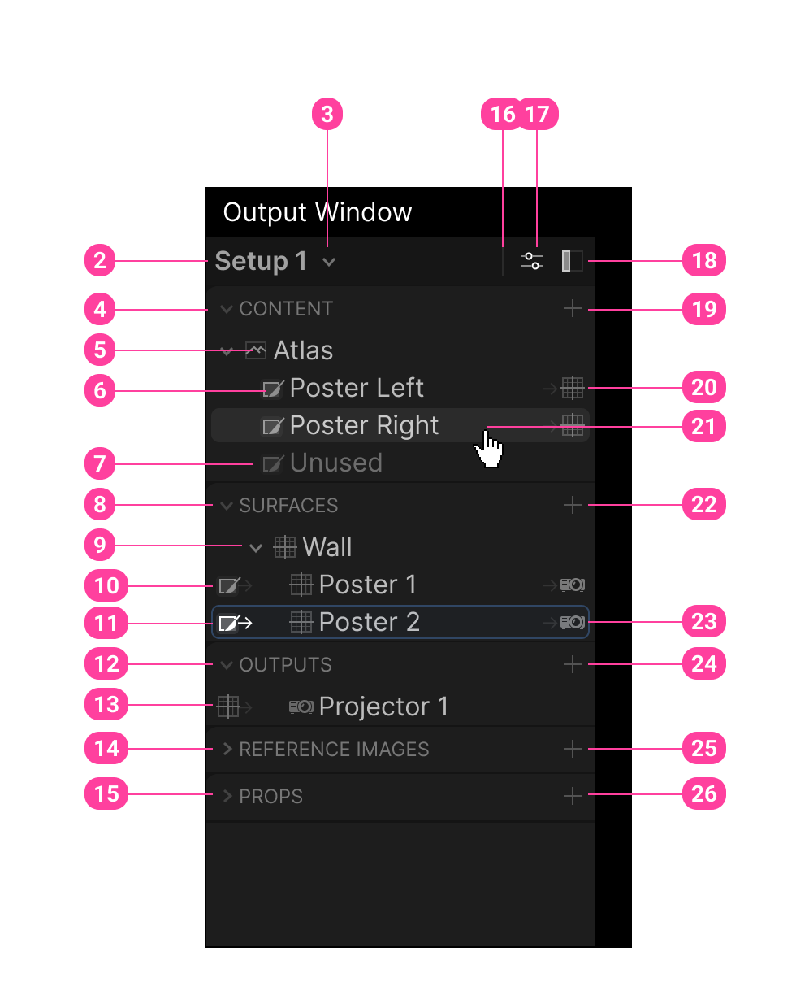

# 2026-07-21 Output Settings Spec

> **Companion docs:** [`data-model.md`](data-model.md) (entities, classes, gaps) · see [`README.md`](README.md) for the full doc set.
> **Undo policy (global):** every mutation except *selection* is undoable — assume an undo command exists for each add / remove / rename / reorder / move-quad / re-slice action. Selection and hover are transient (not undoable).

### Elements

1. -

2. Title of the current setup with an..

3.  indicator to open the Setup Handling menu that allows creating, renaming or removing setups for the current project.

4. The **Content** *Section* . Is a collapsible region, in this case expanded by default. `Style: Font Small. All Caps. Fade(0.4). Tree indicator uses. Icons.ChevronDown|Right.Fade(0.2)`

5. The rounded corner in the top right corner could be drawn with a `Icons.RoundingTopLeft` 

6. The content region lists references from `SendToOutput` operators. It would be great.

   1. Hovering the row should also hover the instance on the graph.
   2. Should have a context menu to...
      1. rename
      2. remove
      3. show in Graph
      4. Add Slice
   3. A Content **Slice** (Icons.Slice) with a custom name.

7. If an **Entity** is not referenced -> row including icon Fade(0.5)

8. The *Surfaces* section is expanded by default

9. Root level surface items are indented ~25px to leave room for **input reference indicators**

10. An *input reference indicator* (icon + Icons.ArrorRight)

11. The item is highlighted because it's referencing an item that is currently hovered (21)

    1. -> Rounded Outline 1px UiColors.Active.Fade(0.3)  / Fill UiColors.Active.Fade(0.1)

12. Outputs secions

13. A Surface reference indicator. Also notice Icons.Projecter for the project element here with a custom name.

14. The reference Images indicator section will be discussed later. Not show here, but a collapsed section could have a rounded bottom left corner using Icons.RoundingSW

15. The Props section will later contain predefined stand ins like humans, hardware, displays of common size, dj-pults, etc.

16. A small **vertical separator** to start Icon group. This should become CustomComponent, if not already defined.

17. A Output Panel Settings opens a context menu. It might contain display options specifc for this panel. We should reserve the space but only show this icon, once with have something for this menu.

18. The **Close Panel toggle ** (Icons.SidebarLeft . Style.Emphasized ). Clicking it will hide the panel and probably jump back to operator view mode. With a closed panel, the PanelToggleIcon should be shown as first item of the Output window toolbar with Style.Dimmed.

19. Adding new content. Clicking this will open a context menu with...

    1. *Add SendToOutput operator* -> This will create an initialize and select a new operator in the visible area of the graph. After creation its item should also be selected in the panel.
    2. *Add Slice* -> Is only enabled if a single content reference is already present or selected (if multiple are present). Clicking it will create a slice, selected it and focus it's name as an input field so it can be immediately renamed. In the Output View canvas I would expect this Slice to appear as an output, displayed as selected (e.g. outline color).

20. An out reference indicator showing that this slice is being used by a surface. Hovering the row or the icon should hover the respective items in the *surfaces section*. On hover we could also show some additional details like the size of the slice in Px and the a small thumbnail of the respective content.

21. This row is being hovered by the mouse. The Pointer indicated a finger, (to be discussed: Because it could also be a grab hand to indicate that this item could be dragged, e.g. onto...

    1. other images
    2. surfaces -> add reference use (note that multiple slices could be used as input to the same surface)
    3.  While dragging the potential drop targets should be indicated, e.g. with an outline (see asset drag handling)

22. Adding surfaces could provide some options, like:

    1. A physical surface -> units would be meters
    2. A Layout surface -> units could be pixels or rem (this might be useful for rearranging slices into a new layout without perspective transforms). In this case the layout surface aspect ratio should probably match the current output.

23. A use by output indicator. We can use the Icons.Projector here, because the output kind is a Projector. Other types might be NDI, Spout, Display, etc.

24. Add Outputs could show a menu with options like...

    1. Projector
    2. NDI
    3. Spout
    4. Display (ideally listing the currently available displays with resolution). 
       Side-Note: What's missing in this example is that an output needs to be bound to the machine's display and that this should probably be indicated or listed here.

25. Using reference images can be a very impressive feature, but only if people discover it.

    1. tooltip could explain "Add reference photos or plans to define stage."
    2. The reference image section should be drop target when dragging image files into the editor.
    3. the menu could list options like...
       1. Add Assets
       2. Paste Image from Clipboard
       3. Add external file (this is tricky because it will introduce a windows forms dependency)
    4. After creating a reference image, it should be show on the *Reference Image Canvas*. This canvas allows users to assemble all relevant references (e.g. floorplans, sections and photos on a single canvas. This canvas should have m units and allow reference images to be easily scaled and aligned. E.g....
       1. Drop in a construction plan of a concert stage
       2. Find a measurement in the time and create an AnnotationLine.
       3. Double click to give the line a length in m.
       4. Right click on the canvas item or panel item and select -> Apply Annotation Dimensions.
       5. For the complete reference photo flow see the prototype and description in  C:\Users\pixtur\dev\research\projectionMapping 

26. The props menu could hold some templates. These might be extensible with a json file that defines things like `{assetPath, height, pivot}`.

    

# Additional notes and ideas

Eventually we want per corner point color adjustment (either full gradient with lift/bias/gain or just a simple color that gets multiplied for each corner and then interpolated with barycentric coordinates).

This means that we probably need some kind of selection  handling for "sub elements" like corners, annotation lines, etc. so we can display their properties in the output settings side panel.

Map mapper has this nice feature that you "sub tweak" a calibration in the straightened local space by adding a transform lattice (e.g. 2x2 initially) and fine tune point positions and tangents. This would initialialy be linear interpolated, but could be adjusted to use Hermite bezier or (weighted) tangents.

- Changing the resolution of the lattices should sample the current definition to initialize the new new vertice points and positions to refine (not lose) the current definition